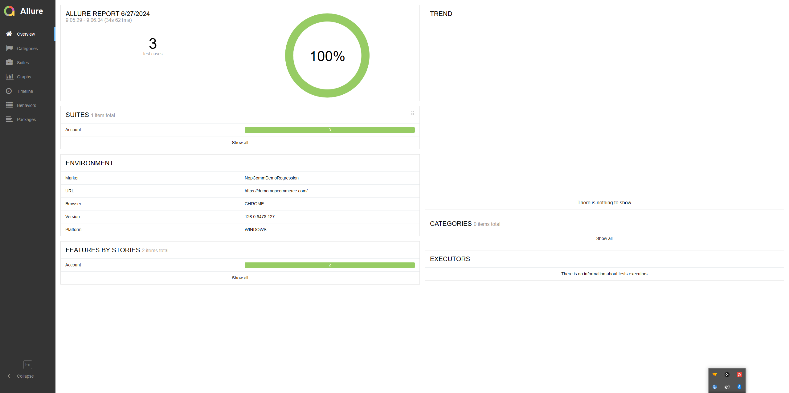

# NopCommerce Demo Test Automation
A Demo project to showcase Test Automation utilizing open source tools like
Selenium, Pytest and Allure Reports

## Environment set-up

Ensure that you have `python` installed 

Pull the git repository.

``` bash
git pull https://github.com/ashish-th/NopComm-automated-test.git
```

Create a Python environment.

``` python
python3 -m venv <env_name>
```

Install the needed modules  using  `requirements.txt` file.

``` python
pip3 install -r requirements.txt
```
## Running Tests
`pytest` automatically picks up files in the currect/sub directory that have the prefix or suffix of `test_*.py` or `*_test.py`, respectively, unless stated explicitly which files to run. And, it requires test function names to start with `test` otherwise it won't treat those functions as test functions and this applies to classes.


``` python
pytest -v # execute all tests in verbose mode
pytest <filename> -v # to execute specific test file
```

Only run tests with names that match the "string expression"
``` python
pytest -k "TestClass and not test_one" 
```
More CLI Arguments
```
 -s                    Show Output, do not caputure
 -x                    Stop after first failure
 -k "expression"       Only run tests that match expession (and fixtures)
 -rs                   Show extra summary info for SKIPPED
 -r chars              Show extra test summary info as specified by chars:
                       (f)ailed, (E)error, (s)skipped, (x)failed, (X)passed
                       (w)pytest-warnings (p)passed, (P)passed with output,
                       (a)all except pP.

 -v                    Verbose
 -q, --quiet           Less verbose

 -l, --showlocals      Show local variables in tracebacks
```
## Jenkins
[Jenkins Build Job]

## Running in docker

```bash

docker build -t sfcc-tests:latest .

# docker run -it --rm sfcc-tests /bin/bash -c 'cd /app && pytest sampleTests/sample.py'

docker run -it --rm sfcc-tests /bin/bash -c 'pytest -m CA_UATORDERS --env=uat-ca testCases'

```
## Allure Reports Docs
https://docs.qameta.io/allure/#_pytest#


